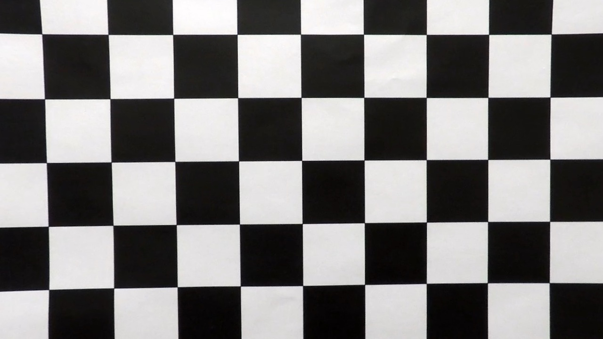

## Project 2: Advanced Lane Finding

### Goal

The goal of this project is to find the lanes on a road from a video using computer vision techniques.

### Technical Approach

The technical approach for this project consists of the following steps:

* Compute the camera calibration matrix and distortion coefficients given a set of chessboard images.
* Apply a distortion correction to raw images.
* Use color transforms, gradients, etc., to create a thresholded binary image.
* Apply a perspective transform to rectify binary image ("birds-eye view").
* Detect lane pixels and fit to find the lane boundary.
* Determine the curvature of the lane and vehicle position with respect to center.
* Warp the detected lane boundaries back onto the original image.
* Output visual display of the lane boundaries and numerical estimation of lane curvature and vehicle position.

---

#### Camera Calibration

The code for this step is contained in the first code cell of the IPython notebook located in "./P2.ipynb".  

I start by preparing "object points", which will be the (x, y, z) coordinates of the chessboard corners in the world. Here I am assuming the chessboard is fixed on the (x, y) plane at z=0, such that the object points are the same for each calibration image.  Thus, `objp` is just a replicated array of coordinates, and `objpoints` will be appended with a copy of it every time I successfully detect all chessboard corners in a test image.  `imgpoints` will be appended with the (x, y) pixel position of each of the corners in the image plane with each successful chessboard detection.  

I then used the output `objpoints` and `imgpoints` to compute the camera calibration and distortion coefficients using the `cv2.calibrateCamera()` function.  I applied this distortion correction to the test image using the `cv2.undistort()` function and obtained the following result: 

|                    Distorted Test Image                     |                   Undistorted Test Image                    |
| :---------------------------------------------------------: | :---------------------------------------------------------: |
|  |  |

#### Pipeline (single images)

##### 1. Distortion-corrected image.

I obtained the camera matrix and the distortion coefficients from the calibration step as shown above. Then I applied those to the test image using `cv2.undistort()`and obtained the following result:

|                    Raw Image                    |                      Undistorted Image                       |
| :---------------------------------------------: | :----------------------------------------------------------: |
|  |  |

##### 2. Color and Gradient Thresholding

I used a combination of color and gradient thresholds to generate a binary image.  The code can be found after the cell titled **Color and Gradient Thresholding** in the IPython notebook.  Here's an example of my output for this step.

|                     Before Thresholding                      |                      After Thresholding                      |
| :----------------------------------------------------------: | :----------------------------------------------------------: |
|  |  |

##### 

##### 3. Perspective Transform

The code for my perspective transform can be found after the cell titled **Perspective Transform**. I use the test image "test_images/straight_lines1.jpg" for the perspective transform. 

I select the source points as

> p1 = [220, 710]
> p2 = [525, 500]
> p3 = [760, 500]
> p4 = [1080, 710]

by making sure that the points lie on the lane markings.

I choose the destination points as

> q1 = [220, 710]
> q2 = [220, 500]
> q3 = [1080, 500]
> q4 = [1080, 710]

However, when I perform the perspective transform, the lane markings look don't look as expected. The lines are not straight. In addition part of the lines look  look blurry. 

Any idea what I am doing wrong?

Showing the images before and after the perspective transform with the colored image for easy debugging. I have added the points in `p1` with "red plus" (r+) signs.

When I apply the perspective transform on the binary images, they look like this.

**Stopped at this point for review feedback**

---

#### 4. Describe how (and identify where in your code) you identified lane-line pixels and fit their positions with a polynomial?

Then I did some other stuff and fit my lane lines with a 2nd order polynomial kinda like this:

![alt text][image5]

#### 5. Describe how (and identify where in your code) you calculated the radius of curvature of the lane and the position of the vehicle with respect to center.

I did this in lines # through # in my code in `my_other_file.py`

#### 6. Provide an example image of your result plotted back down onto the road such that the lane area is identified clearly.

I implemented this step in lines # through # in my code in `yet_another_file.py` in the function `map_lane()`.  Here is an example of my result on a test image:

![alt text][image6]

---

### Pipeline (video)

#### 1. Provide a link to your final video output.  Your pipeline should perform reasonably well on the entire project video (wobbly lines are ok but no catastrophic failures that would cause the car to drive off the road!).

Here's a [link to my video result](./project_video.mp4)

---

### Discussion

#### 1. Briefly discuss any problems / issues you faced in your implementation of this project.  Where will your pipeline likely fail?  What could you do to make it more robust?

Here I'll talk about the approach I took, what techniques I used, what worked and why, where the pipeline might fail and how I might improve it if I were going to pursue this project further.  
