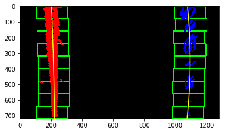
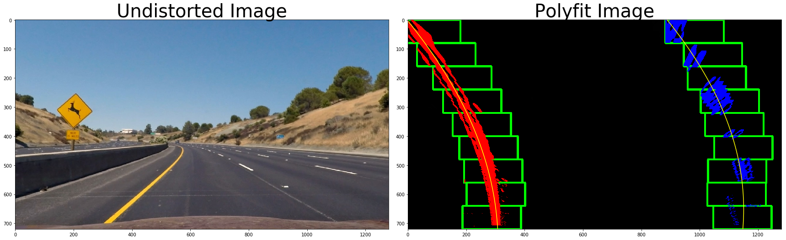
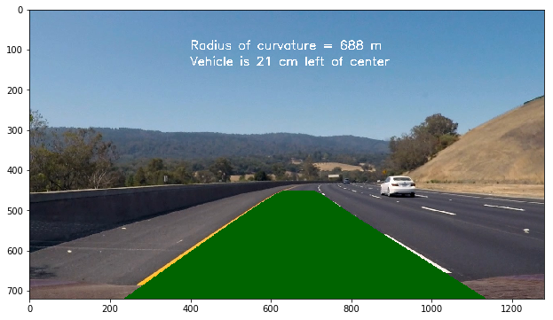

## Project 2: Advanced Lane Finding

### Goal

The goal of this project is to find the lanes on a road from a video using computer vision techniques.

### Technical Approach

The technical approach for this project consists of the following steps:

* Compute the camera calibration matrix and distortion coefficients given a set of chessboard images.
* Apply a distortion correction to raw images.
* Use color transforms, gradients, etc., to create a thresholded binary image.
* Apply a perspective transform to rectify binary image ("birds-eye view").
* Detect lane pixels and fit to find the lane boundary.
* Determine the curvature of the lane and vehicle position with respect to center.
* Warp the detected lane boundaries back onto the original image.
* Output visual display of the lane boundaries and numerical estimation of lane curvature and vehicle position.

---

#### Camera Calibration

The code for this step is contained in the first code cell of the IPython notebook located in "./P2.ipynb".  

I start by preparing "object points", which will be the (x, y, z) coordinates of the chessboard corners in the world. Here I am assuming the chessboard is fixed on the (x, y) plane at z=0, such that the object points are the same for each calibration image.  Thus, `objp` is just a replicated array of coordinates, and `objpoints` will be appended with a copy of it every time I successfully detect all chessboard corners in a test image.  `imgpoints` will be appended with the (x, y) pixel position of each of the corners in the image plane with each successful chessboard detection.  

I then used the output `objpoints` and `imgpoints` to compute the camera calibration and distortion coefficients using the `cv2.calibrateCamera()` function.  I applied this distortion correction to the test image using the `cv2.undistort()` function and obtained the following result: 

|                    Distorted Test Image                     |                   Undistorted Test Image                    |
| :---------------------------------------------------------: | :---------------------------------------------------------: |
|  |  |

#### Pipeline (single images)

##### 1. Distortion-corrected image.

I obtained the camera matrix and the distortion coefficients from the calibration step as shown above. Then I applied those to the test image using `cv2.undistort()`and obtained the following result:

|                    Raw Image                    |                      Undistorted Image                       |
| :---------------------------------------------: | :----------------------------------------------------------: |
|  |  |

##### 2. Color and Gradient Thresholding

I used a combination of color and gradient thresholds to generate a binary image.  The code can be found after the cell titled **Color and Gradient Thresholding** in the IPython notebook.  Here's an example of my output for this step.

|                     Before Thresholding                      |                      After Thresholding                      |
| :----------------------------------------------------------: | :----------------------------------------------------------: |
|  |  |

##### 

##### 3. Perspective Transform

The code for my perspective transform can be found after the cell titled **Perspective Transform**. I use the test image "test_images/straight_lines1.jpg" for the perspective transform. 

I select the source points as

> p1 = [220, 710]
> p2 = [525, 500]
> p3 = [760, 500]
> p4 = [1080, 710]

by making sure that the points lie on the lane markings.

I choose the destination points as

> q1 = [220, 710]
> q2 = [220, 500]
> q3 = [1080, 500]
> q4 = [1080, 710]

I perform the perspective transform using the function `cv2.warpPerspective()`.

The images before and after transform (both color and binary) are shown below. I have added the points `p1, p2, p3, p4` and `q1, q2, q3, q4` with "red plus" (r+) signs on the left and right images.

**Comment:** In the transformed images the lane markings look blurry and distorted toward the top. This may be expected, but need to confirm from review feedback or Student Hub feedback. 

##### 4. Lane-Line Pixels

I identified the lane-line pixels by:

- Taking the histogram of the bottom half of the image;
- Finding the peaks of the histogram in the left half and right half of the histogram;
- Defining window of half-width = 100 pixel and height of 1/9 of the total height of the image and centered around the left and right half histogram centers, and based on the bottom of the image; 
- Finding the non-zero pixels in the left and right windows and appending them in two arrays;
- Averaging the x-coordinate of the non-zero pixels in the left and right window if the number of pixels is greater than 50;
- Sliding up the window by 1/9th of the image height and re-centered if necessary as determined by the previous step;
- Fitting a 2nd order polynomial to the non-zero pixels collected after the window slides up from the bottom of the image to the top of the image. 

The code can be found just after the cell titled **Finding Lane-Line Pixels**.

The output of this process is shown below:

##### 5. Radius of Curvature

I found the radius of curvature for the polynomial `f(y) = A*y**2 + B*y + C ` using:

I decided to calculate the radius of curvature for the left and right lane-lines for a curved road ("./test_images/test2.jpg"). The undistorted image and the 2nd order polynomial fits for the lane-lines are shown in the left and right images below.

The radius calculations show that the left and right radii (in pixel) are: `975.7` and `815.1.`

The relevant code can be found just after the cell titled **Radius of Curvature**.

#### 6. Provide an example image of your result plotted back down onto the road such that the lane area is identified clearly.

I implemented this step in the cell just after the one titled **Projection Back to Lane Image**. The function I created for this is `draw_line()`.  

My current implementation of the function `draw_line()` used to draw the red lines on the video uses the following steps:

1. Create an empty array corresponding to the top-down image;
2. Add 255 to the red layer at pixels corresponding to the points in the left and the right polynomial fits;
3. Project the image back to the front view;
4. Find pixels in the red layer which are of value > 0.5 by searching over the set of indices;
5. Create a wider band of red pixels around the thin lines obtained from Step 5; and
6. Merge the above image with the original image from the front view;

Here is an example of my result on a test image:

---

### Pipeline (video)

Here's a [link to my video result](./output_video/project_video_out.mp4). The video file is located at "./output_video/project_video_out.mp4".

---

### Discussion

The algorithm is run for the video file called `project_video.mp4`. In this case, the processed video looks satisfactory. But the hyper-parameters are tuned for this specific video.  The current pipeline can fail in the following situations:

- Car headlights shining on a wet road coming from opposite direction during night
- Fog
- Snow
- A car in front close to the ego vehicle
- Sharp turn
- If the road in the view used for image processing is shaped like a 'S'

---

 

