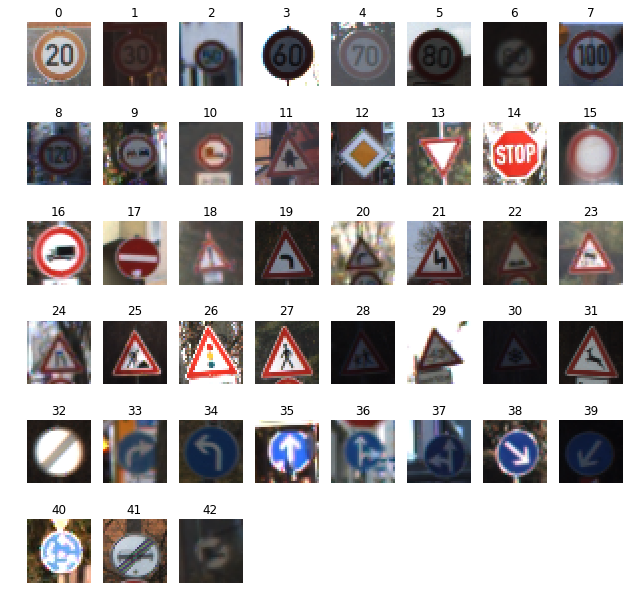
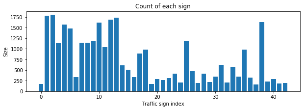
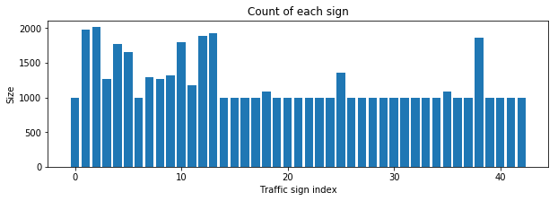
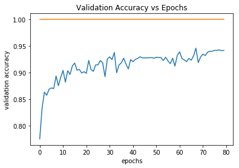
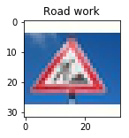
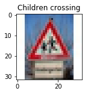
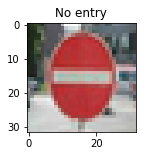
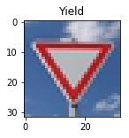
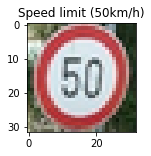

# **Traffic Sign Recognition** 

## Writeup

**Build a Traffic Sign Recognition Project**

The goals / steps of this project are the following:

* Load the data set (see below for links to the project data set)
* Explore, summarize and visualize the data set
* Design, train and test a model architecture
* Use the model to make predictions on new images
* Analyze the softmax probabilities of the new images
* Summarize the results with a written report

The dataset is for German traffic signs. Here's how the images look like.  

<b>German Traffic Signs</b>

## Rubric Points
### Here I will consider the [rubric points](https://review.udacity.com/#!/rubrics/481/view) individually and describe how I addressed each point in my implementation.  

---
### Writeup / README

#### 1. Provide a Writeup / README that includes all the rubric points and how you addressed each one. You can submit your writeup as markdown or pdf. You can use this template as a guide for writing the report. The submission includes the project code.

You're reading it! and here is a link to my [project code](https://github.com/suvoganguli/SDCND-Projects/tree/master/CarND-Traffic-Sign-Classifier-P3).

### Data Set Summary & Exploration

#### 1. Provide a basic summary of the data set. In the code, the analysis should be done using python, numpy and/or pandas methods rather than hardcoding results manually.

I used python to calculate summary statistics of the traffic signs data set.

* The size of training set is 34799.
* The size of the validation set is 4410.
* The size of test set is 12630.
* The shape of a traffic sign image is (32, 32, 3).
* The number of unique classes/labels in the data set is 43.

#### 2. Include an exploratory visualization of the dataset.

Here is an exploratory visualization of the data set. It is a bar chart showing how the data ...

### Design and Test a Model Architecture

#### 1. Describe how you preprocessed the image data. What techniques were chosen and why did you choose these techniques? Consider including images showing the output of each preprocessing technique. Pre-processing refers to techniques such as converting to grayscale, normalization, etc. (OPTIONAL: As described in the "Stand Out Suggestions" part of the rubric, if you generated additional data for training, describe why you decided to generate additional data, how you generated the data, and provide example images of the additional data. Then describe the characteristics of the augmented training set like number of images in the set, number of images for each class, etc.)

For preprocessing, I decide to just normalize the data since the dataset is already large to begin. I wanted to see what kind of validation accuracy I get without other preprocessing. After experimenting with different learning rates and batch sizes, the best validation accuracy I got was 0.759. Even when I added more convolution filters (12 in the first layer instead of 6), the best validation accuracy was 0.780.

Next I converted the RGB images to gray-scale. With this change I experimented with different learning rates. The best accuracy I got was 0.920.

Next I decided to augment the data. After closely inspecting the histogram of the images, I decided to increase the image classes with less than 1000 images to increase to 1000 images. Initially, I experimented with image rotation, translation, scaling, adding noise and blur. The results with blur and noise was not good, so I decided to stick to rotation, translation and scaling.

With the data augmentation and additional convolution filters I was able to get an accuracy of 0.942 and meet the minimum accuracy of 0.93.

#### 2. Describe what your final model architecture looks like including model type, layers, layer sizes, connectivity, etc.) Consider including a diagram and/or table describing the final model.

My final model consisted of the following layers:  

| Layer         		|     Description	        					|
|:---------------------:|:---------------------------------------------:|
| Input         		| 32x32x1 gray-scale image  |
| Convolution 5x5  | 1x1 stride, valid padding, outputs 28x28x12 |
| RELU					|												|
| Max pooling	      	| 2x2 stride,  outputs 14x14x12 |
| Convolution 5x5	 | 1x1 stride, valid padding, outputs 10x10x24 |
| RELU	|         									|
| Max pooling	| 2x2 stride,  outputs 5x5x24 |
| Fully connected | input size 600, output size 300 |
| RELU |												|
| Fully connected | input size 300, output size 100 |
| RELU |	|
| Fully connected | input size 100, output size 43 |
| Softmax |  |

#### 3. Describe how you trained your model. The discussion can include the type of optimizer, the batch size, number of epochs and any hyperparameters such as learning rate.

To train the model, I used the Adam optimizer.

Initially I experimented variation combination of the hyper-parameters for the LeNet architecture. These are shown in the table below. In this experiments I varied the learning rate and the batch size. Although I added dropout layers and L2 regularization, I didn't use those as the validation accuracy I was getting was low.

|  rate  | beta | EPOCHS | BATCH-SIZE | keep_prob | keep_prob_conv | validaion accuracy | test accuracy |   converged   |
| :----: | :--: | :----: | :--------: | :-------: | :------------: | :----------------: | :-----------: | :-----------: |
| 0.001  | 0.00 |   20   |    128     |    1.0    |      1.0       |       0.758        |     0.747     |    almost     |
| 0.0008 | 0.00 |   20   |    128     |    1.0    |      1.0       |       0.748        |     0.738     |    almost     |
| 0.002  | 0.00 |   20   |    128     |    1.0    |      1.0       |       0.779        |     0.746     |    almost     |
| 0.001  | 0.00 |   20   |     64     |    1.0    |      1.0       |       0.788        |     0.769     |    almost     |
| 0.001  | 0.00 |   20   |     32     |    1.0    |      1.0       |       0.759        |     0.755     | almost, noisy |
| 0.0005 | 0.00 |   20   |     32     |    1.0    |      1.0       |       0.733        |     0.734     | almost, noisy |

Next I added more convolution filters (as shown in the network above). Even with that the validation accuracy I got was low.

|  rate  | beta | EPOCHS | BATCH-SIZE | keep_prob | keep_prob_conv | validaion accuracy | test accuracy | converged |
| :----: | :--: | :----: | :--------: | :-------: | :------------: | :----------------: | :-----------: | :-------: |
| 0.0005 | 0.00 |   20   |     64     |    1.0    |      1.0       |       0.780        |     0.774     |  almost   |

I realized I need to do more pre-processing of the data. I changed the images to gray-scale and restarted with LeNet. Experimenting with the hyper-parameters the accuracy increased to 92% which is still below the required 93% accuracy.

|  rate  | beta | EPOCHS | BATCH-SIZE | keep_prob | keep_prob_conv | validaion accuracy | test accuracy |   converged   |
| :----: | :--: | :----: | :--------: | :-------: | :------------: | :----------------: | :-----------: | :-----------: |
| 0.0005 | 0.00 |   20   |     64     |    1.0    |      1.0       |       0.919        |     0.907     | almost, noisy |
| 0.0005 | 0.00 |   40   |    128     |    1.0    |      1.0       |       0.903        |     0.897     |    almost     |
| 0.0003 | 0.00 |   40   |    128     |    1.0    |      1.0       |       0.896        |     0.893     |    almost     |
| 0.0007 | 0.00 |   40   |     64     |    1.0    |      1.0       |    0.900-0.930     |     0.906     | almost, noisy |
| 0.0007 | 0.00 |   40   |    128     |    1.0    |      1.0       |       0.920        |     0.914     |  still noisy  |

Next I decided to make a modification to the LeNet architecture since the network was not learning anymore than 0.92. I added fully connected layer 400x300 after the last convolution later. With that the validation accuracy improved a bit and varied between 0.915-0.930 as shown below

|  rate  | beta | EPOCHS | BATCH-SIZE | keep_prob | keep_prob_conv | validaion accuracy | test accuracy |       converged       |
| :----: | :--: | :----: | :--------: | :-------: | :------------: | :----------------: | :-----------: | :-------------------: |
| 0.0007 | 0.00 |   40   |    128     |    1.0    |      1.0       |    0.915-0.931     |     0.918     | still learning, noisy |

Next I decided to augment the dataset. After closely inspecting the histogram of the images, I decided to increase the image classes with less than 1000 images to increase to 1000 images. The figure below shows the histogram of the images after data augmentation.

Initially, I experimented with image rotation, translation, scaling, adding noise and blur. The results with blur and noise was not good, so I decided to stick to rotation, translation and scaling. With data augmentation I still didn't get the accuracy more than 0.93 consistently.

Continuing with above modification I got the following results.

|  rate  | beta | EPOCHS | BATCH-SIZE | keep_prob | keep_prob_conv | validaion accuracy | test accuracy |       converged       |
| :----: | :--: | :----: | :--------: | :-------: | :------------: | :----------------: | :-----------: | :-------------------: |
| 0.0007 | 0.00 |   40   |    128     |    1.0    |      1.0       |    0.913-0.922     |     0.887     | still learning, noisy |
| 0.0007 | 0.00 |   80   |    128     |    1.0    |      1.0       |    0.914-0.930     |     0.906     | still learning, noisy |

Next I increased the number of filters in the first convolution layer to 12. With this I was finally able to meet the minimum accuracy of 0.93. The validation accuracy I got was 0.942. The test accuracy was 0.927.

|  rate  | beta | EPOCHS | BATCH-SIZE | keep_prob | keep_prob_conv | validaion accuracy | test accuracy |   converged    |
| :----: | :--: | :----: | :--------: | :-------: | :------------: | :----------------: | :-----------: | :------------: |
| 0.0007 | 0.00 |   80   |    128     |    1.0    |      1.0       |       0.942        |     0.927     | still learning |

The figure below shows that I could have better results if I increased the number of epochs further since the network was still learning.

(Note that I decided to not use L2 regularization or dropouts in the final architecture since the test accuracy I got was 0.927 which is close the the validation accuracy.)

#### 4. Describe the approach taken for finding a solution and getting the validation set accuracy to be at least 0.93. Include in the discussion the results on the training, validation and test sets and where in the code these were calculated. Your approach may have been an iterative process, in which case, outline the steps you took to get to the final solution and why you chose those steps. Perhaps your solution involved an already well known implementation or architecture. In this case, discuss why you think the architecture is suitable for the current problem.

My final model results were:
* validation set accuracy of 94.2%
* test set accuracy of 92.7%

Please see the discussion above which shows how to got to the final architecture and choice of hyper-parameters.

### Test a Model on New Images

#### 1. Choose five German traffic signs found on the web and provide them in the report. For each image, discuss what quality or qualities might be difficult to classify.

Here are five German traffic signs that I found on the web:

The first two images might be difficult to classify because the images look blurry. Also the third image might be difficult to classify since the image is taken from an angle.

#### 2. Discuss the model's predictions on these new traffic signs and compare the results to predicting on the test set. At a minimum, discuss what the predictions were, the accuracy on these new predictions, and compare the accuracy to the accuracy on the test set (OPTIONAL: Discuss the results in more detail as described in the "Stand Out Suggestions" part of the rubric).

The test results with the new images was 100% accurate.

Here are the results of the prediction:

| Image			        |     Prediction	        					|
|:---------------------:|:---------------------------------------------:|
| Road Work      		| Road Work   									|
| Children Crossing | Children Crossing |
| No Entry		| No Entry			|
| Yield	    | Yield					 |
| 50 kmph			| 50 kmph      							|

#### 3. Describe how certain the model is when predicting on each of the five new images by looking at the softmax probabilities for each prediction. Provide the top 5 softmax probabilities for each image along with the sign type of each probability. (OPTIONAL: as described in the "Stand Out Suggestions" part of the rubric, visualizations can also be provided such as bar charts)

The code for making predictions on my final model is located toward the end of the Ipython notebook.

For the first image, the probability of Road Work was 100%.

For the second image, the top five probabilities were

| Probability         	|     Prediction	        					|
|:---------------------:|:---------------------------------------------:|
| .995         | Children Crossing |
| .02     		| 80 kmpg 		|
| .02				| 20 kmph									|
| .01	      		| Roundabout Mandatory	|
| .01				    | Slippery Road      							|

For the third image, the probability of No Entry was 100%.

For the fourth image, the probability of Yield was 100%.

For the third image, the probability of 50 kmph was 100%.

---

